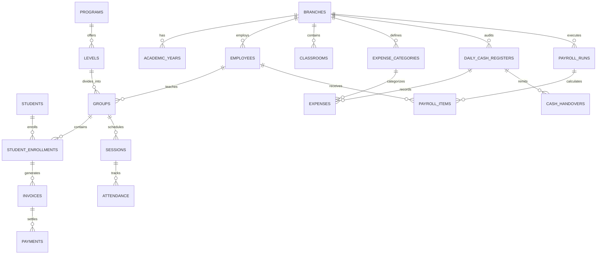

# Relational Database Schema Specification
**Project:** 3abaqira Enterprise Management System (نظام إدارة أكاديمية وروضة العباقرة)  
**Target:** Unified Multi-Branch Relational Database (PostgreSQL / MySQL / SQLite / Supabase)  
**Purpose:** Comprehensive DDL, ER diagram, table relationships, constraints, and migration blueprint designed to completely eliminate reliance on Excel spreadsheets (`center.xlsx` and `rawda.xlsx`).

---

## 1. System Architecture & Domain Model

The legacy Excel system consists of two separate files representing two operating branches under common management:
1. **Branch 1: The Academy / Training Center (`CENTER`)** – Academic tutoring, mental arithmetic (Soroban), Quran, robotics, foreign languages, championships, and per-headcount/per-session coach payroll.
2. **Branch 2: The Daycare & Kindergarten (`RAWDA`)** – Full-day childcare, nursery cohorts (Bébé to Grand Section), cafeteria supply tracking (bread, butcher, dairy), and daily cash drawer reconciliation.

The normalized database design merges these into a **clean 3NF unified relational model**, supporting multi-tenancy by branch while maintaining separate fiscal registers and operational rules.



---

## 2. Relational Schema DDL Specification (PostgreSQL Dialect)

### 2.1. Core Organizations & Infrastructure

```sql
-- 1. Branches (Center vs Rawda)
CREATE TABLE branches (
    branch_id VARCHAR(20) PRIMARY KEY, -- 'CENTER', 'RAWDA'
    branch_name VARCHAR(100) NOT NULL,
    address VARCHAR(255),
    phone VARCHAR(50),
    is_active BOOLEAN DEFAULT TRUE,
    created_at TIMESTAMP WITH TIME ZONE DEFAULT CURRENT_TIMESTAMP
);

-- 2. Academic Fiscal Years
CREATE TABLE academic_years (
    academic_year_id SERIAL PRIMARY KEY,
    name VARCHAR(50) NOT NULL, -- '2024-2025', '2025-2026'
    start_date DATE NOT NULL,
    end_date DATE NOT NULL,
    is_current BOOLEAN DEFAULT FALSE
);

-- 3. Classrooms / Rooms
CREATE TABLE classrooms (
    classroom_id SERIAL PRIMARY KEY,
    branch_id VARCHAR(20) REFERENCES branches(branch_id),
    name VARCHAR(100) NOT NULL, -- e.g., 'قاعة 1', 'قاعة القران 1', 'قاعة المحاضرات'
    capacity INTEGER DEFAULT 20
);
```

---

### 2.2. Student & Guardian Registry

```sql
-- 4. Guardians (Parents)
CREATE TABLE guardians (
    guardian_id SERIAL PRIMARY KEY,
    full_name VARCHAR(150) NOT NULL,
    phone_primary VARCHAR(30) NOT NULL,
    phone_secondary VARCHAR(30),
    relationship VARCHAR(50) DEFAULT 'Parent', -- 'Father', 'Mother'
    created_at TIMESTAMP WITH TIME ZONE DEFAULT CURRENT_TIMESTAMP
);

-- 5. Students Master Table
CREATE TABLE students (
    student_id SERIAL PRIMARY KEY,
    first_name VARCHAR(75) NOT NULL,
    last_name VARCHAR(75) NOT NULL,
    full_name_ar VARCHAR(150) NOT NULL,
    full_name_fr VARCHAR(150), -- Migrated from 'NOM FRANCAIS SOROBAN'
    birth_date DATE,
    gender VARCHAR(10) CHECK (gender IN ('Male', 'Female')),
    medical_notes TEXT,
    created_at TIMESTAMP WITH TIME ZONE DEFAULT CURRENT_TIMESTAMP
);

-- 6. Student Guardian Link
CREATE TABLE student_guardians (
    student_id INTEGER REFERENCES students(student_id) ON DELETE CASCADE,
    guardian_id INTEGER REFERENCES guardians(guardian_id) ON DELETE CASCADE,
    is_emergency_contact BOOLEAN DEFAULT TRUE,
    PRIMARY KEY (student_id, guardian_id)
);
```

---

### 2.3. Academic Programs, Levels & Pricing

```sql
-- 7. Educational Programs
CREATE TABLE programs (
    program_id SERIAL PRIMARY KEY,
    branch_id VARCHAR(20) REFERENCES branches(branch_id),
    code VARCHAR(50) UNIQUE NOT NULL, -- 'SOROBAN', 'QURAN', 'PREP', 'ROBOTICS', 'LANG_LEVELS', 'LANG_SUPPORT', 'SUPPORT_LESSONS', 'SUMMER_CLUB', 'DAYCARE'
    name_ar VARCHAR(100) NOT NULL,
    billing_type VARCHAR(30) NOT NULL CHECK (billing_type IN ('INSTALLMENT_PLAN', 'MONTHLY_RECURRING', 'PER_SESSION', 'ONE_TIME_EVENT'))
);

-- 8. Academic Levels & Divisions
CREATE TABLE levels (
    level_id SERIAL PRIMARY KEY,
    program_id INTEGER REFERENCES programs(program_id),
    level_code VARCHAR(30) NOT NULL, -- 'p1', 'p2', 'j3', 's6', 'bebe', 'petit_1', 'grand_3'
    name_ar VARCHAR(100) NOT NULL,
    color_tag VARCHAR(30), -- 'أخضر', 'أحمر', 'أزرق' (From Feuil9)
    UNIQUE (program_id, level_code)
);

-- 9. Pricing Matrix & Discount Rules (Replacing Sheet 'الأسعار')
CREATE TABLE pricing_plans (
    pricing_plan_id SERIAL PRIMARY KEY,
    level_id INTEGER REFERENCES levels(level_id),
    academic_year_id INTEGER REFERENCES academic_years(academic_year_id),
    standard_installment_price DECIMAL(10,2) NOT NULL, -- e.g., 15000.00
    cash_discount DECIMAL(10,2) DEFAULT 500.00,        -- Cash discount (-500)
    sibling_discount DECIMAL(10,2) DEFAULT 500.00,     -- Sibling discount (-500)
    annual_prepaid_discount DECIMAL(10,2) DEFAULT 0.00, -- e.g., 121500 package
    registration_fee DECIMAL(10,2) DEFAULT 8000.00     -- Pre-school registration
);
```

---

### 2.4. Class Groups & Course Scheduling

```sql
-- 10. Cohort Groups (الأفواج)
CREATE TABLE groups (
    group_id SERIAL PRIMARY KEY,
    level_id INTEGER REFERENCES levels(level_id),
    academic_year_id INTEGER REFERENCES academic_years(academic_year_id),
    group_name VARCHAR(100) NOT NULL, -- e.g., 'p1 Group A', 'moyen section -2'
    lead_teacher_id INTEGER, -- Foreign key to employees
    max_capacity INTEGER DEFAULT 18
);

-- 11. Timetable Slots
CREATE TABLE group_schedules (
    schedule_id SERIAL PRIMARY KEY,
    group_id INTEGER REFERENCES groups(group_id) ON DELETE CASCADE,
    classroom_id INTEGER REFERENCES classrooms(classroom_id),
    day_of_week VARCHAR(20) NOT NULL, -- 'Friday', 'Saturday', etc.
    start_time TIME NOT NULL,
    end_time TIME NOT NULL
);
```

---

### 2.5. Enrollments, Invoicing & Receipts

```sql
-- 12. Student Course Enrollments
CREATE TABLE student_enrollments (
    enrollment_id SERIAL PRIMARY KEY,
    student_id INTEGER REFERENCES students(student_id),
    group_id INTEGER REFERENCES groups(group_id),
    pricing_plan_id INTEGER REFERENCES pricing_plans(pricing_plan_id),
    enrollment_date DATE NOT NULL DEFAULT CURRENT_DATE,
    agreed_total_amount DECIMAL(10,2) NOT NULL,
    payment_mode VARCHAR(30) DEFAULT 'INSTALLMENT', -- 'CASH_UPFRONT', 'INSTALLMENT', 'ANNUAL_PACKAGE'
    has_sibling_discount BOOLEAN DEFAULT FALSE,
    enrollment_status VARCHAR(20) DEFAULT 'ACTIVE' -- 'ACTIVE', 'COMPLETED', 'DROPPED'
);

-- 13. Invoices / Installment Schedules (Replacing 4-Tranche columns in FEILLE & other sheets)
CREATE TABLE invoices (
    invoice_id SERIAL PRIMARY KEY,
    enrollment_id INTEGER REFERENCES student_enrollments(enrollment_id),
    installment_number SMALLINT NOT NULL, -- 1, 2, 3, 4 (or month index 9..7 for Daycare)
    due_date DATE,                        -- 'التاريخ المقترح'
    amount_due DECIMAL(10,2) NOT NULL,
    amount_paid DECIMAL(10,2) DEFAULT 0.00,
    status VARCHAR(20) DEFAULT 'UNPAID' CHECK (status IN ('UNPAID', 'PARTIALLY_PAID', 'PAID', 'OVERDUE'))
);

-- 14. Cash Receipts / Payment Transactions
CREATE TABLE payments (
    payment_id SERIAL PRIMARY KEY,
    invoice_id INTEGER REFERENCES invoices(invoice_id),
    receipt_number VARCHAR(50) NOT NULL UNIQUE, -- 'الوصل'
    payment_date DATE NOT NULL DEFAULT CURRENT_DATE,
    amount DECIMAL(10,2) NOT NULL,
    payment_method VARCHAR(30) DEFAULT 'CASH',
    collected_by_user_id INTEGER,
    remarks TEXT
);
```

---

### 2.6. Staff, Teachers & Wage Formulas

```sql
-- 15. Employees & Instructors Master Table
CREATE TABLE employees (
    employee_id SERIAL PRIMARY KEY,
    branch_id VARCHAR(20) REFERENCES branches(branch_id),
    full_name VARCHAR(150) NOT NULL,
    role VARCHAR(50) NOT NULL, -- 'ADMIN', 'SOROBAN_COACH', 'LANG_TEACHER', 'QURAN_TEACHER', 'NANNY', 'COOK'
    compensation_model VARCHAR(50) NOT NULL, -- 'FIXED_MONTHLY', 'PER_HEADCOUNT', 'PER_SESSION', 'HYBRID'
    base_salary DECIMAL(10,2) DEFAULT 0.00,
    hire_date DATE,
    phone VARCHAR(30),
    is_active BOOLEAN DEFAULT TRUE
);

-- 16. Teaching Sessions & Headcount Log (For Per-Child & Per-Session compensation)
CREATE TABLE completed_sessions (
    session_id SERIAL PRIMARY KEY,
    group_id INTEGER REFERENCES groups(group_id),
    instructor_id INTEGER REFERENCES employees(employee_id),
    session_date DATE NOT NULL,
    duration_hours DECIMAL(4,2) DEFAULT 2.0,
    attended_student_count INTEGER NOT NULL,
    calculated_wage DECIMAL(10,2) NOT NULL
);

-- 17. Monthly Payroll Runs
CREATE TABLE payroll_runs (
    payroll_run_id SERIAL PRIMARY KEY,
    branch_id VARCHAR(20) REFERENCES branches(branch_id),
    month_period VARCHAR(7) NOT NULL, -- '2025-09', '2025-10'
    run_date DATE NOT NULL DEFAULT CURRENT_DATE,
    total_disbursed DECIMAL(12,2) NOT NULL,
    status VARCHAR(20) DEFAULT 'CONFIRMED'
);

-- 18. Employee Payroll Line Items
CREATE TABLE payroll_items (
    payroll_item_id SERIAL PRIMARY KEY,
    payroll_run_id INTEGER REFERENCES payroll_runs(payroll_run_id),
    employee_id INTEGER REFERENCES employees(employee_id),
    base_amount DECIMAL(10,2) NOT NULL,
    variable_session_amount DECIMAL(10,2) DEFAULT 0.00,
    headcount_bonus DECIMAL(10,2) DEFAULT 0.00,
    deductions DECIMAL(10,2) DEFAULT 0.00,
    net_payout DECIMAL(10,2) NOT NULL,
    payment_voucher_no VARCHAR(50),
    notes TEXT
);
```

---

### 2.7. Treasury, Cash Register & Remittances

```sql
-- 19. Daily Cash Registers (Replacing 'الملخص اليومي')
CREATE TABLE daily_cash_registers (
    register_id SERIAL PRIMARY KEY,
    branch_id VARCHAR(20) REFERENCES branches(branch_id),
    register_date DATE NOT NULL,
    opening_balance DECIMAL(12,2) NOT NULL,
    total_revenues DECIMAL(12,2) NOT NULL DEFAULT 0.00,
    total_expenses DECIMAL(12,2) NOT NULL DEFAULT 0.00,
    total_remitted DECIMAL(12,2) NOT NULL DEFAULT 0.00,
    closing_balance DECIMAL(12,2) NOT NULL,
    reconciled_by INTEGER REFERENCES employees(employee_id),
    is_closed BOOLEAN DEFAULT FALSE,
    UNIQUE (branch_id, register_date)
);

-- 20. Cash Remittances / Safe Drop (Replacing 'التسليم')
CREATE TABLE cash_handovers (
    handover_id SERIAL PRIMARY KEY,
    register_id INTEGER REFERENCES daily_cash_registers(register_id),
    receipt_voucher_no VARCHAR(50) UNIQUE,
    amount DECIMAL(10,2) NOT NULL,
    transferred_by INTEGER REFERENCES employees(employee_id),
    received_by_name VARCHAR(100) NOT NULL, -- 'المستلم'
    handover_time TIMESTAMP DEFAULT CURRENT_TIMESTAMP,
    notes TEXT
);
```

---

### 2.8. Operational Expenses & Cafeteria Procurement

```sql
-- 21. Expense Categories
CREATE TABLE expense_categories (
    category_id SERIAL PRIMARY KEY,
    branch_id VARCHAR(20) REFERENCES branches(branch_id),
    name_ar VARCHAR(100) NOT NULL, -- 'حفاظات و مواد التنظيف', 'مواد جافة', 'الخبز', 'خضر وفواكه', 'اللحم و الدجاج', 'مصاريف صيانة'
    is_cafeteria_related BOOLEAN DEFAULT FALSE
);

-- 22. Daily Expenses Ledger (Replacing 'المصاريف' and 'المصروف اليومي')
CREATE TABLE expenses (
    expense_id SERIAL PRIMARY KEY,
    register_id INTEGER REFERENCES daily_cash_registers(register_id),
    category_id INTEGER REFERENCES expense_categories(category_id),
    expense_date DATE NOT NULL,
    description VARCHAR(255) NOT NULL,
    amount DECIMAL(10,2) NOT NULL,
    receipt_attachment_url TEXT,
    created_at TIMESTAMP WITH TIME ZONE DEFAULT CURRENT_TIMESTAMP
);

-- 23. Daily Bread Consumption Tracking (Replacing 'الخبز')
CREATE TABLE daily_bread_logs (
    bread_log_id SERIAL PRIMARY KEY,
    log_date DATE NOT NULL UNIQUE,
    day_of_week VARCHAR(20) NOT NULL,
    scheduled_meal VARCHAR(100) NOT NULL, -- 'كسكس', 'سباقيتي', 'عدس', 'بيري', 'معكرونة'
    loaf_count INTEGER NOT NULL,
    unit_price DECIMAL(6,2) NOT NULL DEFAULT 15.00,
    total_cost DECIMAL(10,2) GENERATED ALWAYS AS (loaf_count * unit_price) STORED,
    remarks TEXT
);

-- 24. Butcher, Poultry & Bulk Provisions Orders (Replacing 'اللحم و الدجاج')
CREATE TABLE provisions_orders (
    order_id SERIAL PRIMARY KEY,
    order_date DATE NOT NULL,
    week_number SMALLINT CHECK (week_number BETWEEN 1 AND 5),
    item_category VARCHAR(100) NOT NULL, -- 'اللحم', 'الدجاج', 'سكالوب مرحي', 'الماء - 5ل', 'البيض', 'الجبن'
    quantity DECIMAL(8,2) NOT NULL,
    unit_measure VARCHAR(20) DEFAULT 'Kg',
    unit_price DECIMAL(10,2) NOT NULL,
    total_amount DECIMAL(10,2) GENERATED ALWAYS AS (quantity * unit_price) STORED,
    supplier_name VARCHAR(100),
    notes TEXT
);
```

---

### 2.9. Competitions & Special Events

```sql
-- 25. Competitions & Championships
CREATE TABLE competitions (
    competition_id SERIAL PRIMARY KEY,
    name VARCHAR(150) NOT NULL, -- 'البطولة الوطنية', 'البطولة الولائية'
    event_date DATE,
    academic_year_id INTEGER REFERENCES academic_years(academic_year_id),
    registration_fee DECIMAL(10,2) NOT NULL
);

-- 26. Competition Registrations
CREATE TABLE competition_registrations (
    registration_id SERIAL PRIMARY KEY,
    competition_id INTEGER REFERENCES competitions(competition_id),
    student_id INTEGER REFERENCES students(student_id),
    division_level VARCHAR(50),
    receipt_number VARCHAR(50) UNIQUE,
    amount_paid DECIMAL(10,2) NOT NULL,
    registration_date DATE DEFAULT CURRENT_DATE,
    notes TEXT
);
```

---

## 3. Data Migration & Ingestion Plan

To safely migrate historical data from `center.xlsx` and `rawda.xlsx` into the relational schema:

1. **Step 1 – Seed Catalogs:**
   - Seed `branches` (`CENTER`, `RAWDA`).
   - Seed `academic_years` (`2024-2025`, `2025-2026`).
   - Seed `programs` and `levels` from `الأسعار`, `الأفواج`, and `تقسيم الافواج`.

2. **Step 2 – Student Master Ingestion:**
   - Merge student records across `FEILLE`, `تحضيري 2025`, `القران`, `اللغات`, and `المداخيل`.
   - Cross-reference Latin names from `NOM FRANCAIS SOROBAN` and `Feuil4` with Arabic names to populate `full_name_fr`.

3. **Step 3 – Financial Records & Historical Receipts:**
   - Migrate installment columns (`الدفعة 1..4`, `الوصل 1..4`) into normalized rows in `invoices` and `payments`.
   - Ensure every historical receipt string (e.g., `12180`, `10235`) is preserved in `payments.receipt_number`.

4. **Step 4 – Cash Registers & Reconciliations:**
   - Ingest daily series from `الملخص اليومي`, `المصاريف`, and `التسليم` into `daily_cash_registers`, `expenses`, and `cash_handovers`.
   - Run automated verification queries ensuring $\text{closing\_balance}$ matches the spreadsheet to the exact cent.
