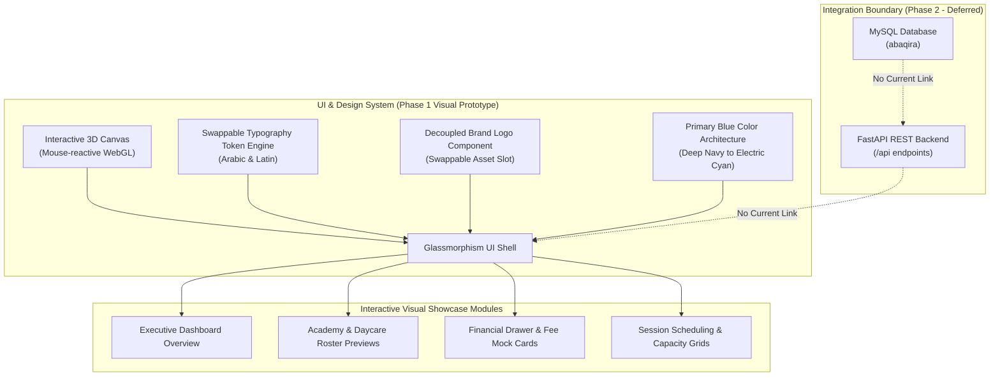
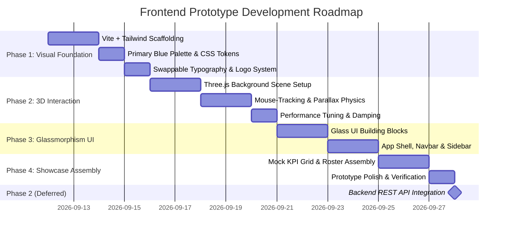

# Frontend Visual Prototype & Design System Specification
**Project:** 3abaqira Enterprise Management System (أكاديمية وروضة الأطفال العباقرة)  
**Target Scope:** High-Fidelity Visual & Interactive Prototype (Non-Practical Template)  
**Primary Color Identity:** Sophisticated Deep Blue & Azure Palette  
**Visual Style:** Ultra-Modern Glassmorphism with Smooth Interactive 3D Background

---

## 1. Executive Summary & Architectural Scope

This document defines the complete architectural blueprint, design system, typography strategy, and visual components for the frontend of the **3abaqira Enterprise Management Platform**.

### Critical Scope Boundaries (Phase 1):
- **Purely Visual & Interactive Mockup:** The template focuses exclusively on UI/UX aesthetics, spatial composition, modern micro-interactions, and visual layouts. It contains **no business computational logic**.
- **Zero Backend Integration Requirement:** There is **no requirement or implementation of live API links, database connections, or backend state synchronizations** during this phase. All dashboard metrics, tables, badges, and rosters will be driven by static visual mock datasets.
- **Swappable Typography & Branding:** The typography engine and logo assets are architected as decoupled configuration tokens, allowing complete replacement of Arabic and Latin typefaces and brand marks in the future without altering layout code.



---

## 2. Brand Identity & Primary Color Architecture

The entire visual system is built around a **luxurious, sophisticated Blue spectrum**, radiating technological maturity, trustworthiness, and elegance.

### 2.1. Blue Color Token Matrix
All UI elements (backgrounds, surfaces, borders, glow shaders, badges, and typography accents) derive from centralized CSS variables:

| Token Name | Hex Code | Purpose & Application |
| :--- | :--- | :--- |
| `--color-primary-950` | `#030712` | Deep void background canvas backing the 3D scene |
| `--color-primary-900` | `#0A192F` | Midnight navy background tint and dark surface containers |
| `--color-primary-800` | `#0F274A` | Secondary background cards, modal containers, and drawer panels |
| `--color-primary-700` | `#1E3A8A` | Deep royal blue accents, focused table rows, hover states |
| `--color-primary-600` | `#2563EB` | **Primary Brand Blue** — Primary call-to-action buttons, active tab indicators |
| `--color-primary-500` | `#3B82F6` | Vibrant sapphire — Icon highlights, button gradients, active states |
| `--color-primary-400` | `#60A5FA` | Azure glow — Borders of glassmorphic containers, selected pill tags |
| `--color-primary-300` | `#93C5FD` | Sky blue — Subheadings, secondary typography accents |
| `--color-primary-100` | `#DBEAFE` | Frosted ice blue — Subtle hover overlays and translucent badge tints |
| `--color-accent-cyan`  | `#06B6D4` | Electric cyan — 3D particle flares and high-priority status indicators |

### 2.2. Glassmorphic Surface Specifications
To achieve depth and elegance, cards and panels float above the 3D interactive backdrop using multi-layered frosted glass styling:
- **Card Background:** `rgba(15, 39, 74, 0.45)` with `backdrop-filter: blur(16px)`
- **Border Treatment:** `1px solid rgba(96, 165, 250, 0.18)`
- **Box Shadow:** `0 8px 32px 0 rgba(2, 6, 23, 0.37), inset 0 1px 0 0 rgba(255, 255, 255, 0.08)`
- **Hover Micro-glow:** Transition to `rgba(37, 99, 235, 0.25)` border glow with subtle scale transform (`1.01x`).

---

## 3. Typography & Swappable Font Strategy

The platform requires dual support for **Arabic** (primary institutional language) and **Latin** (French & English). Because the user specified that all fonts will be completely modified and replaced at a later stage, typography must be cleanly decoupled via abstract tokens.

### 3.1. Tokenized Font Abstraction Layer
No hardcoded font families will exist within UI components. Fonts are bound strictly to abstract CSS variables:

```css
:root {
  /* Default Prototype Fonts (Easily swappable later via single config) */
  --font-family-latin: 'Inter', -apple-system, BlinkMacSystemFont, 'Segoe UI', Roboto, sans-serif;
  --font-family-arabic: 'Cairo', 'Alexandria', 'Tajawal', -apple-system, sans-serif;
  --font-family-display: 'Outfit', 'Cairo', sans-serif;
  --font-family-mono: 'JetBrains Mono', 'Fira Code', monospace;
}

/* Global Typography Application */
[dir="ltr"] {
  font-family: var(--font-family-latin);
}

[dir="rtl"] {
  font-family: var(--font-family-arabic);
}
```

### 3.2. Future Font Migration Procedure
When the new custom font files (TTF/WOFF2) or web fonts are selected:
1. Place font assets in `frontend/public/fonts/` or update the `@font-face` declaration in `frontend/src/styles/fonts.css`.
2. Update the token definitions `--font-family-latin` and `--font-family-arabic` in `frontend/src/styles/globals.css`.
3. The entire site across all headings, badges, tables, and navbars will adapt instantly without layout reflow issues.

### 3.3. Bilingual Directionality (RTL / LTR)
- Layout containers use CSS logical properties (`margin-inline-start`, `padding-inline-end`, `border-inline-start`).
- Seamless toggling between Arabic (RTL) and Latin/French (LTR) modes without duplicating stylesheets.

---

## 4. Swappable Brand Logo Component

The logo is encapsulated inside a dedicated, isolated component (`<BrandLogo />`) to guarantee 1-click replacement when the final visual emblem and wordmark are finalized.

### 4.1. Component Interface
```jsx
// frontend/src/components/branding/BrandLogo.jsx
export function BrandLogo({ size = "md", variant = "full", className = "" }) {
  // Swappable asset paths & configuration
  const logoConfig = {
    iconOnly: "/assets/branding/logo-icon-placeholder.svg",
    fullLogo: "/assets/branding/logo-full-placeholder.svg",
    brandNameAr: "أكاديمية وروضة الأطفال العباقرة",
    brandNameEn: "3abaqira Academy & Daycare",
    tagline: "Enterprise Management Suite"
  };

  return (
    <div className={`flex items-center gap-3 select-none ${className}`}>
      <div className="relative flex items-center justify-center p-2 rounded-xl bg-gradient-to-br from-blue-500/20 to-blue-700/10 border border-blue-400/30 backdrop-blur-md shadow-lg shadow-blue-500/10">
        
      </div>
      {variant === "full" && (
        <div className="flex flex-col">
          <span className="font-display font-bold text-lg text-white tracking-wide">
            {logoConfig.brandNameEn}
          </span>
          <span className="text-xs text-blue-300 font-medium font-arabic">
            {logoConfig.brandNameAr}
          </span>
        </div>
      )}
    </div>
  );
}
```

---

## 5. Interactive 3D Background Engine

A centerpiece of the modern aesthetic is an interactive **WebGL 3D background** that dynamically responds to cursor movement, mouse hover, and viewport orientation with high fidelity and ultra-smooth damping.

### 5.1. Visual Concept & 3D Composition
- **Geometric Concept:** A crystalline low-poly celestial lattice (or floating icosahedral nodes) interconnected by luminous filaments and a deep starfield particle mesh.
- **Lighting & Shader Palette:**
  - Ambient base: Deep indigo / midnight navy (`#0A192F`)
  - Point lights: Electric cyan (`#06B6D4`) and Royal sapphire (`#3B82F6`) tracking cursor positions
  - Specular highlights: Subtly reflecting off geometric edges as the camera moves
- **Mouse Dynamics & Motion Physics:**
  - **Parallax Tilt:** The camera smoothly tracks mouse coordinates $(X, Y)$ normalized from $[-1, +1]$.
  - **Fluid Damping (Lerping):** Camera rotation and object motion use exponential decay damping (`lerp(current, target, 0.05)`), preventing jerky jumps and ensuring smooth, fluid, cinematic motion.
  - **Interactive Particle Repulsion:** When the user moves the mouse rapidly, nearby floating particles gently disperse and drift back to equilibrium.
  - **Scroll Parallax:** Scrolling down the dashboard triggers camera depth shifts along the Z-axis.

### 5.2. Technical Implementation Architecture
- **Engine:** Three.js via `@react-three/fiber` and `@react-three/drei` (or lightweight native Three.js canvas).
- **Performance Safeguards:**
  - Dynamic pixel ratio clamping (`dpr={[1, 2]}`) to prevent overheating on 4K / retina displays.
  - Geometry instancing (`InstancedMesh`) to render hundreds of nodes in a single draw call.
  - Frame throttling with `requestAnimationFrame` and automatic pausing when tab is backgrounded.
  - Respect for `prefers-reduced-motion` accessibility preferences.

---

## 6. Visual Template UI Components (Prototype Scope)

The frontend prototype showcases the functional visual appearance of the enterprise management suite using high-fidelity mock representations:

### 6.1. Navigation & App Shell
- **Frosted Top Navigation Bar:**
  - Swappable `<BrandLogo />` slot
  - Global search bar with shortcut tag (`Ctrl + K`)
  - Bilingual switcher pill (`العربية` / `Français` / `English`)
  - Multi-tenant Branch Indicator toggle (`المركز - Training Center` ⇄ `الروضة - Daycare`)
  - User avatar with status badge (`Admin / مدير النظام`)

- **Collapsible Glassmorphic Sidebar:**
  - Icon-driven navigation links (Overview, Students & Roster, Academics & Cohorts, Cash Treasury, Cafeteria & Kitchen, HR & Payroll, System Audits)
  - Subtle glowing active tab indicator

### 6.2. Executive Dashboard Overview (Mock View)
- **Welcome Hero Panel:** Greeting banner featuring date, active fiscal year (`2025-2026`), and quick action buttons.
- **KPI Analytic Metric Cards:**
  - Total Enrolled Students (`273 الأطفال / الطلاب`) with percentage trend pills
  - Daily Cash Register Balance (`142,500 دج Live Drawer`)
  - Active Educational Programs (`8 مسارات تعليمية`)
  - Cafeteria Supply Status (`الخبز والمواد الغذائية - تم التموين`)
- **Visual Analytics Showcase:** High-resolution CSS/SVG area charts representing monthly tuition collection and daily expense distribution.

### 6.3. Student Roster & Data Grid Visuals
- Tabular visual mock demonstrating the unified Academy / Kindergarten registry:
  - Columns: Student ID, Bilingual Name (`محمد بلقاسم / Belkacem Mohammed`), Program/Cohort, Payment Status Badge (`PAID`, `PARTIAL`, `OVERDUE`), Actions.
  - Custom glassmorphic table styling with subtle hover row highlighting and pagination footer.

### 6.4. Modal & Drawer Preview Templates
- Mock **New Student Registration** modal window with tabbed sections (General Information, Guardian Linking, Tuition Plan).
- Mock **Cash Drawer Reconciliation** voucher summary with print voucher preview button.

---

## 7. Recommended Frontend Technology Stack

| Layer | Recommended Technology | Rationale |
| :--- | :--- | :--- |
| **Bundler & Runtime** | **Vite + React 18+** | Extremely fast hot module replacement (HMR), minimal bundle footprint, standard React ecosystem. |
| **Styling & Design Tokens** | **Tailwind CSS + PostCSS** | Rapid glassmorphism development, utility-first CSS variable mapping, effortless RTL support (`rtl:` variant). |
| **3D Canvas & WebGL** | **Three.js** (`@react-three/fiber` & `@react-three/drei`) | Declarative, component-driven 3D scene graph with native React state integration and high-performance render loop. |
| **Micro-Interactions & Motion** | **Framer Motion** | Physics-based spring animations for glass cards, modal enter/exit transitions, and button hover states. |
| **Iconography** | **Lucide Icons (`lucide-react`)** | Clean, minimalist, modern SVG icon set with consistent line weight matching the glassmorphic aesthetic. |

---

## 8. Directory Architecture for `frontend/`

```
frontend/
├── public/
│   ├── assets/
│   │   └── branding/              # Swappable logo SVGs, emblems & wordmarks
│   │       ├── logo-full-placeholder.svg
│   │       └── logo-icon-placeholder.svg
│   └── favicon.ico
├── src/
│   ├── components/
│   │   ├── 3d/                    # Interactive 3D WebGL Background
│   │   │   ├── InteractiveBackground.jsx
│   │   │   ├── ParticleField.jsx
│   │   │   └── FloatingGeometry.jsx
│   │   ├── branding/              # Swappable Brand & Logo components
│   │   │   └── BrandLogo.jsx
│   │   ├── common/                # Glassmorphic UI building blocks
│   │   │   ├── GlassCard.jsx
│   │   │   ├── GlassButton.jsx
│   │   │   ├── StatusBadge.jsx
│   │   │   ├── ModalDialog.jsx
│   │   │   └── StatCounterCard.jsx
│   │   ├── layout/                # Shell, navigation & direction wrappers
│   │   │   ├── Navbar.jsx
│   │   │   ├── Sidebar.jsx
│   │   │   └── PageShell.jsx
│   │   └── dashboard/             # Visual prototype modules
│   │       ├── HeroBanner.jsx
│   │       ├── MetricGrid.jsx
│   │       ├── MockDataGrid.jsx
│   │       └── QuickActionPanel.jsx
│   ├── mock/                      # Static dummy data for visual demonstration
│   │   ├── mockStudents.js
│   │   ├── mockMetrics.js
│   │   └── mockPrograms.js
│   ├── styles/                    # Global tokens, typography & animations
│   │   ├── globals.css            # Primary blue CSS variables, glass styling
│   │   └── fonts.css              # Swappable font-family declarations
│   ├── App.jsx                    # Prototype root rendering the visual layout
│   └── main.jsx                   # React DOM entrypoint
├── index.html
├── package.json
├── vite.config.js
├── tailwind.config.js
└── README.md                      # Directory documentation
```

---

## 9. Phased Implementation Roadmap



### Phase 1: Visual Foundation & Design Tokens
1. Initialize Vite + React project with Tailwind CSS configuration.
2. Establish the Primary Blue CSS variable palette in `globals.css`.
3. Set up the swappable typography engine and `<BrandLogo />` component.

### Phase 2: 3D Mouse-Driven Background
1. Implement the Three.js Canvas container positioned behind the UI.
2. Build low-poly geometric meshes with deep blue and cyan specular lighting.
3. Attach mouse event listeners with smooth lerp damping for fluid, lag-free responsiveness.

### Phase 3: Glassmorphic Component Library
1. Build reusable glass cards, buttons, badges, and modal dialogs.
2. Construct the frosted navigation bar with language and branch indicators.
3. Ensure crisp contrast and accessibility over the moving 3D background.

### Phase 4: Prototype Dashboard Assembly
1. Populate KPI metric cards, recent enrollments, and cash drawer summaries with static mock data.
2. Implement modal and drawer preview interactions.
3. Review and polish animations and responsiveness across screen sizes.

---

## 10. Summary Statement on Future Integration

> [!IMPORTANT]
> **Definitive Development Guideline:**
> The prototype being developed under this plan is exclusively a **visual, non-computational model**. No effort or time should be spent attempting to connect endpoints to `backend/apis/` or binding live database queries during this stage. The priority is crafting an extraordinary, high-end visual identity, fluid 3D mouse interaction, and an easily reconfigurable typography and branding architecture. Full API integration will follow as a separate, distinct development milestone once the visual model is reviewed and approved.
